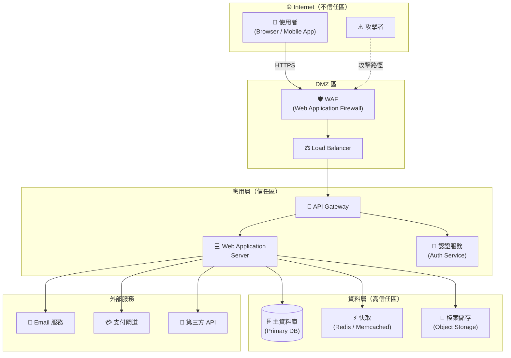

# Threat Modeling Report

> **⚠️ 使用說明（給 Claude）**
> 本文件為 Threat Modeling Report Template。請根據使用者提供的系統資訊，逐節填寫所有 `{{placeholder}}` 欄位，並刪除所有說明性的 `> 提示文字`。若某節不適用，請標記為 `N/A` 並說明原因。

---

## 封面資訊

| 欄位 | 內容 |
|------|------|
| **報告標題** | {{系統/專案名稱}} Threat Modeling Report |
| **版本** | v{{1.0}} |
| **報告日期** | {{YYYY-MM-DD}} |
| **報告作者** | {{姓名 / 團隊}} |
| **審查者** | {{審查人員姓名}} |
| **機密等級** | {{公開 / 內部 / 機密 / 最高機密}} |
| **適用系統** | {{系統名稱及版本}} |
| **報告狀態** | {{草稿 / 審查中 / 最終版}} |

---

## 修訂歷史

| 版本 | 日期 | 作者 | 修訂說明 |
|------|------|------|----------|
| v1.0 | {{YYYY-MM-DD}} | {{作者}} | 初始版本 |
| v{{X.X}} | {{YYYY-MM-DD}} | {{作者}} | {{修訂說明}} |

---

## 目錄

1. [執行摘要](#1-執行摘要)
2. [專案與系統概述](#2-專案與系統概述)
3. [威脅建模方法論](#3-威脅建模方法論)
4. [範圍與邊界定義](#4-範圍與邊界定義)
5. [系統架構分析](#5-系統架構分析)
6. [資產識別與分類](#6-資產識別與分類)
7. [信任邊界與資料流分析](#7-信任邊界與資料流分析)
8. [攻擊者模型（Attacker Profile）](#8-攻擊者模型)
9. [威脅識別（STRIDE 分析）](#9-威脅識別stride-分析)
10. [威脅風險評估（DREAD / CVSS）](#10-威脅風險評估)
11. [攻擊樹分析（Attack Tree）](#11-攻擊樹分析)
12. [MITRE ATT&CK 對應](#12-mitre-attck-對應)
13. [現有安全控制評估](#13-現有安全控制評估)
14. [風險處理計畫與緩解措施](#14-風險處理計畫與緩解措施)
15. [殘餘風險](#15-殘餘風險)
16. [測試與驗證建議](#16-測試與驗證建議)
17. [合規性對應](#17-合規性對應)
18. [結論與後續行動](#18-結論與後續行動)
19. [附錄](#19-附錄)

---

## 1. 執行摘要

> 提示：為非技術利害關係人撰寫的高階摘要，說明最重要的威脅與建議行動。

### 1.1 摘要說明

{{本次威脅建模針對 [系統名稱] 進行全面性分析，識別出 [高風險威脅數量] 個高風險威脅、[中風險] 個中風險威脅及 [低風險] 個低風險威脅。最嚴重的風險集中在 [關鍵風險領域]，建議優先採取 [最重要的緩解措施]。}}

### 1.2 風險概況總覽

| 風險等級 | 威脅數量 | 已緩解 | 待處理 |
|----------|----------|--------|--------|
| 🔴 **嚴重（Critical）** | {{N}} | {{N}} | {{N}} |
| 🟠 **高（High）** | {{N}} | {{N}} | {{N}} |
| 🟡 **中（Medium）** | {{N}} | {{N}} | {{N}} |
| 🟢 **低（Low）** | {{N}} | {{N}} | {{N}} |
| **合計** | {{N}} | {{N}} | {{N}} |

### 1.3 最高優先級建議行動

1. **[立即行動]** {{最緊急的緩解措施}}
2. **[短期 30 天]** {{短期需完成的改善項目}}
3. **[中期 90 天]** {{中期改善計畫}}

---

## 2. 專案與系統概述

### 2.1 系統描述

> 提示：描述系統的業務目的、主要功能及使用情境。

{{系統名稱}} 是一個 {{系統類型，例如：Web 應用程式 / 微服務架構 / 行動應用程式}}，主要用途為 {{業務目的}}。

**主要功能：**
- {{功能 1}}
- {{功能 2}}
- {{功能 3}}

**部署環境：**

| 項目 | 說明 |
|------|------|
| 部署模式 | {{雲端 / 地端 / 混合雲}} |
| 雲端服務商 | {{AWS / Azure / GCP / 不適用}} |
| 作業系統 | {{Linux / Windows / 容器化}} |
| 主要技術棧 | {{程式語言、框架、資料庫}} |
| 使用者數量 | {{預估使用者數}} |
| 資料敏感度 | {{一般 / 個資 / 財務資料 / 機密資料}} |

### 2.2 利害關係人

| 角色 | 姓名 / 單位 | 責任 |
|------|------------|------|
| 系統擁有者 | {{姓名}} | {{責任說明}} |
| 開發負責人 | {{姓名}} | {{責任說明}} |
| 資安負責人 | {{姓名}} | {{責任說明}} |
| 營運負責人 | {{姓名}} | {{責任說明}} |
| 法遵負責人 | {{姓名}} | {{責任說明}} |

---

## 3. 威脅建模方法論

> 提示：說明本次分析所採用的方法論與工具。

### 3.1 採用方法論

本報告採用以下威脅建模方法論：

- [x] **STRIDE** — 威脅分類框架（Spoofing, Tampering, Repudiation, Information Disclosure, DoS, Elevation of Privilege）
- [x] **DREAD** — 風險評分模型（Damage, Reproducibility, Exploitability, Affected Users, Discoverability）
- [x] **PASTA** — Process for Attack Simulation and Threat Analysis
- [ ] **LINDDUN** — 隱私威脅建模
- [x] **MITRE ATT&CK** — 攻擊技術對應框架
- [x] **Attack Tree** — 攻擊路徑視覺化分析

### 3.2 建模工具

| 工具 | 用途 |
|------|------|
| {{工具名稱，例如 OWASP Threat Dragon}} | {{用途}} |
| {{Microsoft Threat Modeling Tool}} | {{用途}} |
| {{Draw.io / Lucidchart}} | {{架構圖與 DFD 繪製}} |

### 3.3 分析流程

```
1. 系統資訊收集與文件審閱
       ↓
2. 架構分析與 DFD 繪製
       ↓
3. 資產識別與信任邊界劃定
       ↓
4. 攻擊者模型定義
       ↓
5. STRIDE 威脅識別
       ↓
6. DREAD / CVSS 風險評分
       ↓
7. MITRE ATT&CK 對應
       ↓
8. 緩解措施設計
       ↓
9. 殘餘風險評估
       ↓
10. 報告產出與審查
```

---

## 4. 範圍與邊界定義

### 4.1 範圍說明

**納入範圍（In-Scope）：**
- {{元件 / 服務 / 功能 1}}
- {{元件 / 服務 / 功能 2}}
- {{元件 / 服務 / 功能 3}}

**排除範圍（Out-of-Scope）：**
- {{排除項目 1 及排除原因}}
- {{排除項目 2 及排除原因}}

### 4.2 分析假設與限制

**假設條件：**
- {{假設 1，例如：基礎設施由雲端服務商負責安全}}
- {{假設 2，例如：內部網路已部署防火牆}}

**已知限制：**
- {{限制 1，例如：源碼審查未納入本次範圍}}
- {{限制 2，例如：第三方元件依賴供應商安全公告}}

---

## 5. 系統架構分析

### 5.1 高階架構圖

> 提示：在此插入系統架構圖（建議使用 Mermaid 語法或嵌入圖片連結）。



### 5.2 資料流圖（DFD - Level 0）

> 提示：描述主要資料流向，包含輸入/輸出資料、處理程序和資料儲存。

**主要資料流：**

| 流程編號 | 來源 | 目的地 | 資料內容 | 傳輸協定 | 加密 |
|----------|------|--------|----------|----------|------|
| DF-01 | 使用者瀏覽器 | WAF | HTTP 請求（含 Session Token） | HTTPS/TLS 1.3 | ✅ |
| DF-02 | API Gateway | Auth Service | JWT 驗證請求 | HTTPS（內部） | ✅ |
| DF-03 | Web Application | 主資料庫 | SQL 查詢（含使用者資料） | TCP（內網） | ❌ |
| DF-04 | Web Application | 外部 Email 服務 | 通知信件（含使用者 Email） | SMTP/TLS | ✅ |
| DF-{{N}} | {{來源}} | {{目的地}} | {{資料描述}} | {{協定}} | {{是/否}} |

### 5.3 技術元件清單

| 元件 ID | 元件名稱 | 類型 | 版本 | 技術 | 角色說明 |
|---------|----------|------|------|------|----------|
| COMP-01 | {{Web Application Server}} | 應用程式 | {{v X.X}} | {{Node.js / Python / Java}} | {{處理業務邏輯}} |
| COMP-02 | {{API Gateway}} | 基礎設施 | {{v X.X}} | {{Kong / AWS API GW}} | {{請求路由與速率限制}} |
| COMP-03 | {{主資料庫}} | 資料儲存 | {{v X.X}} | {{PostgreSQL / MySQL}} | {{儲存核心業務資料}} |
| COMP-04 | {{認證服務}} | 安全元件 | {{v X.X}} | {{Keycloak / Auth0}} | {{身份驗證與授權}} |
| COMP-{{N}} | {{元件名稱}} | {{類型}} | {{版本}} | {{技術}} | {{角色}} |

---

## 6. 資產識別與分類

> 提示：識別所有需要保護的資產，依機密性、完整性、可用性進行分類。

### 6.1 資料資產

| 資產 ID | 資產名稱 | 資料類型 | 機密性 | 完整性 | 可用性 | 整體重要性 | 儲存位置 |
|---------|----------|----------|--------|--------|--------|------------|----------|
| DA-01 | 使用者個人資料 | PII | 🔴 高 | 🔴 高 | 🟡 中 | **嚴重** | 主資料庫 |
| DA-02 | 認證憑證（密碼雜湊） | 認證資料 | 🔴 高 | 🔴 高 | 🟡 中 | **嚴重** | 主資料庫 |
| DA-03 | API 金鑰 / Token | 機密資料 | 🔴 高 | 🔴 高 | 🟠 高 | **嚴重** | 環境變數 / 金鑰管理服務 |
| DA-04 | 交易記錄 | 財務資料 | 🟠 高 | 🔴 高 | 🟠 高 | **嚴重** | 主資料庫 |
| DA-05 | 系統日誌 | 運營資料 | 🟡 中 | 🔴 高 | 🟡 中 | **中** | 日誌系統 |
| DA-{{N}} | {{資產名稱}} | {{類型}} | {{等級}} | {{等級}} | {{等級}} | {{等級}} | {{位置}} |

### 6.2 系統資產

| 資產 ID | 資產名稱 | 重要性 | 單點失效 | 說明 |
|---------|----------|--------|----------|------|
| SA-01 | {{認證服務}} | 🔴 嚴重 | ✅ 是 | {{所有使用者認證依賴此服務}} |
| SA-02 | {{主資料庫}} | 🔴 嚴重 | ✅ 是 | {{核心業務資料儲存}} |
| SA-03 | {{API Gateway}} | 🟠 高 | ❌ 否 | {{具備冗餘部署}} |
| SA-{{N}} | {{資產名稱}} | {{重要性}} | {{是/否}} | {{說明}} |

---

## 7. 信任邊界與資料流分析

### 7.1 信任邊界定義

| 邊界 ID | 邊界名稱 | 描述 | 跨越此邊界的資料流 |
|---------|----------|------|-------------------|
| TB-01 | 網際網路 ↔ DMZ | 外部使用者與 WAF 之間 | DF-01 |
| TB-02 | DMZ ↔ 應用層 | WAF/LB 與應用伺服器之間 | DF-02 |
| TB-03 | 應用層 ↔ 資料層 | 應用程式與資料庫之間 | DF-03 |
| TB-04 | 應用層 ↔ 外部服務 | 系統呼叫外部第三方服務 | DF-04 |
| TB-{{N}} | {{邊界名稱}} | {{描述}} | {{相關資料流}} |

### 7.2 跨信任邊界風險摘要

| 信任邊界 | 風險說明 | 現有控制 |
|----------|----------|----------|
| TB-01 | 未經授權的外部存取、DDoS 攻擊 | WAF、Rate Limiting |
| TB-02 | 內部橫向移動攻擊 | 網路分段、防火牆規則 |
| TB-03 | SQL Injection、未加密傳輸 | Prepared Statements（部分實作） |
| TB-04 | 第三方 API 金鑰外洩、供應鏈攻擊 | API 金鑰輪換機制（待實作） |

---

## 8. 攻擊者模型

### 8.1 攻擊者類型（Threat Actor）

| 攻擊者 ID | 攻擊者類型 | 動機 | 技術能力 | 資源 | 可能目標 |
|-----------|------------|------|----------|------|----------|
| TA-01 | 外部駭客（黑帽） | 財務利益、資料竊取 | 🔴 高 | 🟡 中 | 使用者資料、支付資訊 |
| TA-02 | 惡意內部人員 | 個人利益、報復 | 🟠 中-高 | 🔴 高（內部存取） | 敏感業務資料 |
| TA-03 | 國家級駭客組織（APT） | 情報蒐集、破壞 | 🔴 極高 | 🔴 高 | 系統破壞、資料竊取 |
| TA-04 | 競爭對手 | 商業間諜 | 🟡 中 | 🟡 中 | 商業機密、技術 IP |
| TA-05 | 指令碼小子（Script Kiddie） | 名譽、好奇心 | 🟢 低 | 🟢 低 | 一般可存取端點 |
| TA-06 | 自動化掃描工具 | 大規模漏洞掃描 | 🟡 中 | 🟢 低 | 已知 CVE 漏洞 |

### 8.2 攻擊情境假設

> 提示：定義最有可能的攻擊情境，作為威脅識別的基礎。

**情境 1：外部攻擊者針對 Web 應用程式**
- 攻擊者類型：TA-01、TA-05
- 入侵路徑：公開網際網路 → WAF → Web Application
- 主要目標：使用者認證資料、個人資料外洩

**情境 2：內部威脅**
- 攻擊者類型：TA-02
- 入侵路徑：內部網路直接存取 → 資料庫
- 主要目標：批量下載敏感資料

**情境 3：供應鏈攻擊**
- 攻擊者類型：TA-03
- 入侵路徑：惡意第三方套件 → CI/CD Pipeline → 生產環境
- 主要目標：持久化後門、長期潛伏

---

## 9. 威脅識別（STRIDE 分析）

> 提示：針對每個系統元件，使用 STRIDE 框架識別對應威脅。

### STRIDE 威脅類別說明

| 類別 | 全名 | 說明 | 影響的安全屬性 |
|------|------|------|----------------|
| **S** | Spoofing（仿冒） | 假冒合法使用者或系統 | 認證（Authentication） |
| **T** | Tampering（竄改） | 未經授權修改資料或程式碼 | 完整性（Integrity） |
| **R** | Repudiation（否認） | 否認曾執行的操作 | 不可否認性（Non-repudiation） |
| **I** | Information Disclosure（資訊洩露） | 資料外洩給未授權人員 | 機密性（Confidentiality） |
| **D** | Denial of Service（阻斷服務） | 使服務不可用 | 可用性（Availability） |
| **E** | Elevation of Privilege（特權提升） | 取得超出授權的存取權限 | 授權（Authorization） |

### 9.1 威脅清單

#### 認證與授權威脅

| 威脅 ID | 元件 | STRIDE | 威脅描述 | 攻擊者 | 前提條件 | 初始風險 |
|---------|------|--------|----------|--------|----------|----------|
| THR-001 | 登入端點 | S | 攻擊者透過暴力破解或憑證填充（Credential Stuffing）攻擊，使用已洩露的帳密嘗試登入系統，取得合法使用者帳戶存取權 | TA-01, TA-05 | 無 MFA 機制、無登入失敗次數限制 | 🔴 高 |
| THR-002 | Session 管理 | S | 攻擊者透過 XSS 或網路竊聽取得有效的 Session Token，利用 Session Hijacking 冒充合法使用者 | TA-01 | Session Token 未正確保護、缺乏 HTTPOnly/Secure 旗標 | 🔴 高 |
| THR-003 | API 端點 | E | 攻擊者透過 IDOR（Insecure Direct Object Reference）存取其他使用者的資源，取得未授權的資料 | TA-01 | 缺乏物件層級授權驗證（BOLA） | 🟠 高 |
| THR-004 | JWT Token | S, T | 攻擊者偽造 JWT Token（Algorithm Confusion 攻擊，如 RS256 改 HS256），取得系統管理員權限 | TA-01 | JWT 驗證邏輯不嚴謹 | 🔴 嚴重 |

#### 資料層威脅

| 威脅 ID | 元件 | STRIDE | 威脅描述 | 攻擊者 | 前提條件 | 初始風險 |
|---------|------|--------|----------|--------|----------|----------|
| THR-005 | 資料庫查詢介面 | T, I | 攻擊者透過應用程式輸入點注入惡意 SQL 指令（SQL Injection），讀取、修改或刪除資料庫中的敏感資料 | TA-01, TA-05 | 未使用 Parameterized Query | 🔴 嚴重 |
| THR-006 | 資料傳輸（應用層→DB） | I | 資料庫連線未加密，攻擊者在內部網路進行中間人攻擊（MITM），竊取資料庫查詢回傳的敏感資料 | TA-02, TA-01 | DB 連線未啟用 TLS/SSL | 🟠 高 |
| THR-007 | 備份資料 | I | 未加密的資料庫備份檔案遭未授權人員取得，導致大量敏感資料外洩 | TA-02 | 備份未加密、存取控制不足 | 🟠 高 |

#### 應用程式威脅

| 威脅 ID | 元件 | STRIDE | 威脅描述 | 攻擊者 | 前提條件 | 初始風險 |
|---------|------|--------|----------|--------|----------|----------|
| THR-008 | 前端 Web 應用 | T, I | 攻擊者在頁面中注入惡意腳本（XSS），竊取使用者的 Session Token 或執行惡意操作 | TA-01, TA-05 | 缺乏輸出編碼、CSP 未設定 | 🟠 高 |
| THR-009 | 敏感操作端點 | T | 攻擊者利用 CSRF 攻擊，誘導已登入使用者在不知情情況下執行惡意操作（如更改密碼、轉帳） | TA-01 | 缺乏 CSRF Token | 🟡 中 |
| THR-010 | 檔案上傳功能 | T, E | 攻擊者上傳惡意可執行檔（如 WebShell），取得伺服器遠端執行程式碼（RCE）的能力 | TA-01 | 檔案類型驗證不嚴謹 | 🔴 嚴重 |
| THR-011 | 系統日誌 | R | 攻擊者（含內部人員）在執行惡意操作後，竄改或刪除系統日誌，湮滅犯罪證據 | TA-02, TA-01 | 日誌寫入權限控制不足 | 🟡 中 |

#### 基礎設施威脅

| 威脅 ID | 元件 | STRIDE | 威脅描述 | 攻擊者 | 前提條件 | 初始風險 |
|---------|------|--------|----------|--------|----------|----------|
| THR-012 | 所有服務端點 | D | 攻擊者發動分散式阻斷服務攻擊（DDoS），耗盡系統資源，使服務對合法使用者不可用 | TA-01, TA-05 | 缺乏 DDoS 防護機制 | 🟠 高 |
| THR-013 | CI/CD Pipeline | T, E | 攻擊者入侵 CI/CD 流程，在建置過程中注入惡意程式碼，影響生產環境的軟體完整性 | TA-03 | CI/CD 存取控制不足 | 🔴 嚴重 |
| THR-014 | 第三方套件依賴 | T | 惡意的 NPM/PyPI 套件透過供應鏈攻擊被引入，在執行時期洩露資料或建立後門 | TA-03 | 缺乏軟體組成分析（SCA） | 🟠 高 |
| THR-{{N}} | {{元件}} | {{STRIDE}} | {{威脅描述}} | {{攻擊者}} | {{前提條件}} | {{風險}} |

---

## 10. 威脅風險評估

### 10.1 DREAD 評分說明

| 維度 | 英文 | 評分說明（1-10） |
|------|------|-----------------|
| **D** | Damage Potential | 若成功利用，潛在損害程度 |
| **R** | Reproducibility | 攻擊可重現的難易程度 |
| **E** | Exploitability | 成功利用漏洞的難易程度 |
| **A** | Affected Users | 受影響使用者的數量或比例 |
| **D** | Discoverability | 攻擊者發現此漏洞的難易程度 |

**DREAD 評分：平均分 ≥ 7 = 高風險 / 5-6 = 中風險 / ≤ 4 = 低風險**

### 10.2 威脅風險評分矩陣

| 威脅 ID | 威脅摘要 | D | R | E | A | D | **DREAD 分數** | 風險等級 | 優先處理順序 |
|---------|----------|---|---|---|---|---|----------------|----------|--------------|
| THR-001 | 暴力破解 / 憑證填充 | 8 | 9 | 7 | 9 | 9 | **8.4** | 🔴 高 | P1 |
| THR-002 | Session Hijacking | 9 | 7 | 6 | 8 | 6 | **7.2** | 🔴 高 | P1 |
| THR-003 | IDOR / BOLA | 8 | 8 | 7 | 7 | 7 | **7.4** | 🔴 高 | P1 |
| THR-004 | JWT 偽造 | 10 | 6 | 7 | 10 | 5 | **7.6** | 🔴 嚴重 | P0 |
| THR-005 | SQL Injection | 10 | 8 | 7 | 10 | 7 | **8.4** | 🔴 嚴重 | P0 |
| THR-006 | DB 連線 MITM | 8 | 5 | 6 | 9 | 6 | **6.8** | 🟠 高 | P2 |
| THR-007 | 備份資料外洩 | 9 | 4 | 5 | 10 | 4 | **6.4** | 🟠 高 | P2 |
| THR-008 | XSS 攻擊 | 7 | 7 | 7 | 8 | 7 | **7.2** | 🔴 高 | P1 |
| THR-009 | CSRF 攻擊 | 6 | 6 | 6 | 7 | 6 | **6.2** | 🟠 中 | P2 |
| THR-010 | 惡意檔案上傳 / RCE | 10 | 7 | 7 | 10 | 6 | **8.0** | 🔴 嚴重 | P0 |
| THR-011 | 日誌竄改 | 6 | 5 | 7 | 5 | 5 | **5.6** | 🟡 中 | P3 |
| THR-012 | DDoS 攻擊 | 8 | 9 | 8 | 10 | 9 | **8.8** | 🔴 嚴重 | P0 |
| THR-013 | CI/CD Pipeline 攻擊 | 10 | 4 | 6 | 10 | 5 | **7.0** | 🔴 高 | P1 |
| THR-014 | 供應鏈攻擊 | 9 | 5 | 6 | 10 | 6 | **7.2** | 🔴 高 | P1 |
| THR-{{N}} | {{摘要}} | {{}} | {{}} | {{}} | {{}} | {{}} | {{}} | {{}} | {{}} |

### 10.3 風險矩陣

```
可能性
  高  │ THR-001  │ THR-008  │ THR-005  │
      │ THR-012  │ THR-003  │ THR-010  │
  中  │ THR-009  │ THR-006  │ THR-004  │
      │ THR-011  │ THR-014  │ THR-013  │
  低  │ THR-007  │ THR-002  │ THR-XXX  │
      └──────────┴──────────┴──────────┘
           低          中          高
                    影響程度
```

---

## 11. 攻擊樹分析

> 提示：針對最高風險威脅，以攻擊樹呈現攻擊路徑。

### 11.1 攻擊樹：未授權存取使用者帳戶（THR-001, THR-002, THR-004）

```
[目標] 取得使用者帳戶控制權
│
├── [路徑 A] 直接認證攻擊
│   ├── A1: 暴力破解登入（THR-001）
│   │   ├── A1.1: 無登入失敗鎖定
│   │   └── A1.2: 無 CAPTCHA 防護
│   ├── A2: 憑證填充攻擊（THR-001）
│   │   └── A2.1: 使用已洩露帳密資料庫
│   └── A3: 密碼重置功能濫用
│       ├── A3.1: 可預測的重置 Token
│       └── A3.2: 缺乏 Token 時效性控制
│
├── [路徑 B] Session 劫持（THR-002）
│   ├── B1: XSS 竊取 Session Token（THR-008）
│   │   ├── B1.1: 反射型 XSS
│   │   └── B1.2: 儲存型 XSS
│   ├── B2: 網路竊聽（MITM）
│   │   └── B2.1: HTTP 非加密傳輸
│   └── B3: Session Fixation
│
└── [路徑 C] Token 偽造（THR-004）
    ├── C1: JWT Algorithm Confusion
    │   └── C1.1: 接受 "alg: none"
    ├── C2: JWT 弱密鑰暴力破解
    │   └── C2.1: HS256 + 弱密鑰
    └── C3: 洩露的 JWT Secret
        └── C3.1: 硬編碼於程式碼
```

### 11.2 攻擊樹：資料庫資料外洩（THR-005, THR-006, THR-007）

```
[目標] 取得資料庫敏感資料
│
├── [路徑 A] SQL Injection（THR-005）
│   ├── A1: 基於錯誤的 SQL Injection
│   ├── A2: Blind SQL Injection
│   └── A3: Time-based SQL Injection
│
├── [路徑 B] 內部網路 MITM（THR-006）
│   └── B1: ARP Spoofing 攻擊
│       └── B1.1: DB 連線未加密
│
└── [路徑 C] 備份資料存取（THR-007）
    ├── C1: 未授權存取備份儲存
    │   └── C1.1: 備份資料夾權限過寬
    └── C2: 備份檔案未加密直接讀取
```

---

## 12. MITRE ATT&CK 對應

> 提示：將識別的威脅對應至 MITRE ATT&CK 框架的 Tactics 和 Techniques。

### 12.1 ATT&CK 對應表（Enterprise Matrix）

| 威脅 ID | 威脅描述 | ATT&CK Tactic | ATT&CK Technique ID | Technique 名稱 |
|---------|----------|---------------|---------------------|----------------|
| THR-001 | 暴力破解攻擊 | Credential Access | T1110 | Brute Force |
| THR-001 | 憑證填充攻擊 | Credential Access | T1110.004 | Credential Stuffing |
| THR-002 | Session Hijacking | Credential Access | T1539 | Steal Web Session Cookie |
| THR-004 | JWT 偽造 | Defense Evasion | T1600 | Weaken Encryption |
| THR-005 | SQL Injection | Initial Access | T1190 | Exploit Public-Facing Application |
| THR-008 | XSS 攻擊 | Execution | T1059.007 | JavaScript (Client-Side Script) |
| THR-010 | 惡意檔案上傳 | Execution | T1505.003 | Web Shell |
| THR-012 | DDoS 攻擊 | Impact | T1499 | Endpoint Denial of Service |
| THR-013 | CI/CD Pipeline 攻擊 | Initial Access | T1195.002 | Compromise Software Supply Chain |
| THR-014 | 供應鏈攻擊（套件） | Initial Access | T1195.001 | Compromise Software Dependencies |
| THR-{{N}} | {{描述}} | {{Tactic}} | {{Technique ID}} | {{Technique}} |

### 12.2 ATT&CK Kill Chain 視角

| Kill Chain 階段 | 相關威脅 | 防禦重點 |
|----------------|----------|----------|
| 偵查（Reconnaissance） | THR-012（探測） | 隱藏服務版本資訊、WAF 規則 |
| 初始存取（Initial Access） | THR-005, THR-010, THR-013 | 輸入驗證、WAF、SCA |
| 執行（Execution） | THR-008, THR-010 | CSP、沙箱隔離 |
| 憑證存取（Credential Access） | THR-001, THR-002, THR-004 | MFA、強密碼政策、JWT 加固 |
| 橫向移動（Lateral Movement） | THR-003, THR-006 | 網路分段、最小權限 |
| 資料外洩（Exfiltration） | THR-005, THR-006, THR-007 | DLP、資料加密、存取監控 |
| 影響（Impact） | THR-012, THR-011 | DDoS 防護、日誌保護 |

---

## 13. 現有安全控制評估

### 13.1 安全控制清單與有效性評估

| 控制項 ID | 控制類型 | 控制措施 | 對應威脅 | 實作狀態 | 有效性 | 備註 |
|-----------|----------|----------|----------|----------|--------|------|
| CTRL-01 | 預防性 | Web Application Firewall (WAF) | THR-005, THR-008, THR-012 | ✅ 已實作 | 🟡 中 | 規則需更新 |
| CTRL-02 | 預防性 | HTTPS / TLS 1.3 加密傳輸 | THR-002, THR-006 | ✅ 已實作 | 🟢 高 | — |
| CTRL-03 | 預防性 | 密碼雜湊（bcrypt） | THR-001 | ✅ 已實作 | 🟢 高 | — |
| CTRL-04 | 預防性 | 多因素認證（MFA） | THR-001, THR-002 | ❌ 未實作 | — | **待實作** |
| CTRL-05 | 預防性 | 登入失敗次數限制 | THR-001 | ⚠️ 部分實作 | 🟡 中 | 僅限部分端點 |
| CTRL-06 | 預防性 | Parameterized Query | THR-005 | ⚠️ 部分實作 | 🟡 中 | 部分舊模組未遵循 |
| CTRL-07 | 預防性 | CSRF Token | THR-009 | ✅ 已實作 | 🟢 高 | — |
| CTRL-08 | 偵測性 | SIEM / 日誌監控 | THR-001, THR-011 | ⚠️ 部分實作 | 🟡 中 | 告警規則不完整 |
| CTRL-09 | 預防性 | 軟體組成分析（SCA） | THR-014 | ❌ 未實作 | — | **待實作** |
| CTRL-10 | 回復性 | 資料備份機制 | 所有 DoS 威脅 | ✅ 已實作 | 🟡 中 | 備份未加密 |
| CTRL-{{N}} | {{類型}} | {{控制措施}} | {{威脅}} | {{狀態}} | {{有效性}} | {{備註}} |

### 13.2 安全控制覆蓋率

| STRIDE 類別 | 現有控制數 | 有效控制數 | 覆蓋率 |
|-------------|------------|------------|--------|
| Spoofing（仿冒） | 3 | 2 | 67% |
| Tampering（竄改） | 4 | 2 | 50% |
| Repudiation（否認） | 1 | 1 | 100% |
| Information Disclosure（資訊洩露） | 3 | 2 | 67% |
| Denial of Service（阻斷服務） | 2 | 1 | 50% |
| Elevation of Privilege（特權提升） | 2 | 1 | 50% |

---

## 14. 風險處理計畫與緩解措施

> 提示：針對每個已識別威脅，提供具體、可執行的緩解措施。

### 14.1 風險處理策略

每個威脅可採用以下其中一種風險處理策略：

| 策略 | 說明 |
|------|------|
| **降低（Mitigate）** | 實施安全控制以降低風險 |
| **轉移（Transfer）** | 透過保險或外包轉移風險 |
| **接受（Accept）** | 低風險且成本效益不佳時接受風險 |
| **迴避（Avoid）** | 移除風險來源的功能或元件 |

### 14.2 緩解措施詳細計畫

#### 🔴 P0：嚴重（立即處理，7 天內）

---

**THR-004 / THR-005 / THR-010 / THR-012 — 最高優先級緩解措施**

| 項目 | 內容 |
|------|------|
| **威脅 ID** | THR-004 |
| **威脅描述** | JWT Algorithm Confusion 攻擊 |
| **風險處理策略** | 降低（Mitigate） |
| **緩解措施** | 1. 明確指定 JWT 驗證允許的演算法白名單（僅允許 RS256/ES256）<br>2. 拒絕 `alg: none` 的 JWT Token<br>3. 定期輪換 JWT 簽名金鑰<br>4. 實作 JWT 黑名單（已登出 Token）<br>5. 設定 JWT 有效期（access token ≤ 15 分鐘） |
| **實作負責人** | {{後端開發團隊}} |
| **預計完成日** | {{YYYY-MM-DD}} |
| **驗證方式** | 滲透測試、程式碼審查 |
| **實作後風險** | 🟡 中 |

---

| 項目 | 內容 |
|------|------|
| **威脅 ID** | THR-005 |
| **威脅描述** | SQL Injection |
| **風險處理策略** | 降低（Mitigate） |
| **緩解措施** | 1. 全面審查並修正所有使用字串拼接的 SQL 查詢，改用 Prepared Statement / Parameterized Query<br>2. 導入 ORM 框架（如 SQLAlchemy、Hibernate）統一資料庫存取<br>3. WAF 中啟用 SQL Injection 偵測規則<br>4. 資料庫帳號最小權限原則（僅給予 SELECT/INSERT/UPDATE，禁止 DROP）<br>5. 定期執行 SAST 掃描（如 SonarQube）偵測 Injection 風險 |
| **實作負責人** | {{後端開發團隊}} |
| **預計完成日** | {{YYYY-MM-DD}} |
| **驗證方式** | DAST 掃描（OWASP ZAP）、滲透測試 |
| **實作後風險** | 🟢 低 |

---

#### 🟠 P1：高（短期處理，30 天內）

| 威脅 ID | 緩解措施摘要 | 負責人 | 期限 | 實作後風險 |
|---------|-------------|--------|------|------------|
| THR-001 | 實作 MFA（TOTP/SMS）、登入失敗鎖定（5 次 / 帳號封鎖 15 分鐘）、CAPTCHA、帳號活動異常告警 | {{開發團隊}} | {{日期}} | 🟢 低 |
| THR-002 | Session Token 設定 HTTPOnly + Secure 旗標、實作 Session Rotation（登入後更新 Token）、設定合理 Session Timeout | {{開發團隊}} | {{日期}} | 🟡 中 |
| THR-003 | 實作物件層級授權驗證（BOLA/IDOR 防護）、所有 API 端點強制驗證當前使用者擁有所請求物件的存取權 | {{開發團隊}} | {{日期}} | 🟢 低 |
| THR-008 | 實作嚴格的 Content Security Policy (CSP)、所有輸出進行 HTML Entity Encoding、啟用 X-XSS-Protection Header | {{前端開發}} | {{日期}} | 🟢 低 |
| THR-013 | CI/CD Pipeline 加入程式碼簽名驗證、設定分支保護規則、部署前強制程式碼審查、實作 Secrets Scanning | {{DevOps 團隊}} | {{日期}} | 🟡 中 |
| THR-014 | 導入 SCA 工具（如 Snyk、OWASP Dependency-Check）至 CI/CD Pipeline、建立允許套件白名單、定期更新依賴 | {{DevOps 團隊}} | {{日期}} | 🟡 中 |

#### 🟡 P2：中（中期處理，90 天內）

| 威脅 ID | 緩解措施摘要 | 負責人 | 期限 | 實作後風險 |
|---------|-------------|--------|------|------------|
| THR-006 | 啟用資料庫連線 TLS/SSL 加密，更新連線字串設定，驗證憑證有效性 | {{DBA / 後端}} | {{日期}} | 🟢 低 |
| THR-007 | 備份資料加密（AES-256），實作備份存取控制，備份存放異地加密儲存 | {{DBA / 維運}} | {{日期}} | 🟢 低 |
| THR-009 | 全面審查 CSRF Token 實作，確保所有狀態變更操作都有 CSRF 保護 | {{開發團隊}} | {{日期}} | 🟢 低 |
| THR-011 | 日誌寫入使用 Append-Only 機制，日誌傳送至獨立的 SIEM 系統，實作日誌完整性保護 | {{資安 / 維運}} | {{日期}} | 🟢 低 |
| THR-012 | 評估並部署 CDN + DDoS 防護服務（如 Cloudflare、AWS Shield），設定 Rate Limiting 規則 | {{維運團隊}} | {{日期}} | 🟡 中 |

---

## 15. 殘餘風險

> 提示：列出在所有緩解措施實作後仍存在的剩餘風險，供管理層知悉並決策。

### 15.1 殘餘風險登記

| 風險 ID | 威脅 ID | 殘餘風險描述 | 殘餘風險等級 | 風險接受者 | 風險接受日期 | 下次審查日 |
|---------|---------|-------------|-------------|-----------|------------|------------|
| RR-001 | THR-012 | DDoS 防護有規模上限，超大規模攻擊仍可能造成服務中斷 | 🟡 中 | {{CISO}} | {{日期}} | {{日期}} |
| RR-002 | THR-013 | CI/CD 安全控制無法完全防範零日攻擊，仍需持續監控 | 🟡 中 | {{CTO}} | {{日期}} | {{日期}} |
| RR-003 | THR-001 | 即使有 MFA，SIM 卡交換攻擊仍是潛在威脅 | 🟢 低 | {{CISO}} | {{日期}} | {{日期}} |
| RR-{{N}} | {{威脅ID}} | {{描述}} | {{等級}} | {{接受者}} | {{日期}} | {{日期}} |

---

## 16. 測試與驗證建議

### 16.1 安全測試計畫

| 測試類型 | 測試範圍 | 建議工具 | 執行頻率 | 對應威脅 |
|----------|----------|----------|----------|----------|
| SAST（靜態應用安全測試） | 原始碼 | SonarQube, Semgrep, Bandit | 每次 CI/CD 建置 | THR-005, THR-008 |
| DAST（動態應用安全測試） | 運行中應用程式 | OWASP ZAP, Burp Suite | 每次版本發布前 | THR-001, THR-005, THR-008, THR-009 |
| SCA（軟體組成分析） | 第三方依賴 | Snyk, OWASP Dependency-Check | 每日 | THR-014 |
| 滲透測試 | 全系統 | 專業滲透測試服務 | 每年 / 重大變更後 | 所有威脅 |
| 滲透測試 — API | API 端點 | Postman, Burp Suite | 每季 | THR-003, THR-004, THR-005 |
| 紅隊演練 | 全系統 | 安全顧問服務 | 每年 | THR-001 ~ THR-014 |
| 雲端安全配置稽核 | 雲端基礎設施 | Prowler, ScoutSuite | 每月 | THR-006, THR-007 |
| 日誌與告警測試 | SIEM 規則 | 手動測試 / 自動化 | 每季 | THR-011 |

### 16.2 關鍵測試案例（Test Cases）

| 測試案例 ID | 對應威脅 | 測試描述 | 預期結果 | 測試方法 |
|------------|----------|----------|----------|----------|
| TC-001 | THR-001 | 嘗試連續錯誤登入 10 次，驗證帳戶鎖定機制 | 第 5 次失敗後帳戶被鎖定 15 分鐘 | 自動化測試 |
| TC-002 | THR-004 | 使用 `alg: none` 的 JWT Token 嘗試存取受保護端點 | 請求被拒絕（401 Unauthorized） | 滲透測試 |
| TC-003 | THR-005 | 在搜尋欄位輸入 SQL 注入 payload（如 `' OR 1=1 --`） | 請求被 WAF 攔截或回傳錯誤訊息 | DAST 掃描 |
| TC-004 | THR-008 | 在輸入欄位提交 XSS payload（如 `<script>alert(1)</script>`） | Payload 被 HTML 編碼，無法執行 | DAST 掃描 |
| TC-005 | THR-010 | 嘗試上傳 `.php` 或 `.jsp` 可執行檔案 | 上傳被拒絕（415 Unsupported Media Type） | 手動測試 |
| TC-{{N}} | {{威脅}} | {{描述}} | {{預期}} | {{方法}} |

---

## 17. 合規性對應

> 提示：將安全控制與業界法規/標準對應，確認合規缺口。

### 17.1 合規框架對應矩陣

| 合規要求 | 法規 / 標準 | 相關條款 | 對應威脅 | 對應控制 | 合規狀態 |
|----------|------------|---------|----------|----------|----------|
| 資料加密傳輸 | GDPR / PCI DSS | Art. 32 / Req 4 | THR-006 | CTRL-02 | ✅ 符合 |
| 存取控制 | ISO 27001 / NIST | A.9 / AC | THR-001, THR-003 | CTRL-04, CTRL-05 | ⚠️ 部分符合 |
| 安全日誌記錄 | SOC 2 / PCI DSS | CC7.2 / Req 10 | THR-011 | CTRL-08 | ⚠️ 部分符合 |
| 漏洞管理 | PCI DSS / NIST | Req 6 / SI | THR-014 | CTRL-09 | ❌ 不符合 |
| 多因素認證 | NIST SP 800-63 / Zero Trust | AAL2 | THR-001, THR-002 | CTRL-04 | ❌ 不符合（待實作） |
| 個人資料保護 | GDPR / PDPA | Art. 25 | THR-005, THR-007 | CTRL-01, CTRL-10 | ⚠️ 部分符合 |
| {{要求}} | {{法規}} | {{條款}} | {{威脅}} | {{控制}} | {{狀態}} |

---

## 18. 結論與後續行動

### 18.1 總結

{{本次威脅建模分析針對 [系統名稱] 共識別出 [N] 個威脅，其中嚴重等級 [N] 個、高風險 [N] 個、中風險 [N] 個、低風險 [N] 個。最重要的安全風險集中在 [認證機制、輸入驗證、資料保護] 等領域。}}

{{整體而言，系統目前的安全控制基礎尚可，但在多因素認證、全面的 SQL Injection 防護、供應鏈安全管理等方面存在顯著缺口，建議依照優先順序逐一改善。}}

### 18.2 後續行動追蹤表

| 行動項目 | 對應威脅 | 負責人 | 目標期限 | 狀態 |
|----------|----------|--------|----------|------|
| 修正 JWT 驗證邏輯 | THR-004 | {{後端負責人}} | {{日期}} | 🔴 待開始 |
| 全面修正 SQL 查詢 | THR-005 | {{後端負責人}} | {{日期}} | 🔴 待開始 |
| 修正惡意檔案上傳漏洞 | THR-010 | {{後端負責人}} | {{日期}} | 🔴 待開始 |
| 實作 MFA 機制 | THR-001, THR-002 | {{開發團隊}} | {{日期}} | 🔴 待開始 |
| 導入 SCA 至 CI/CD | THR-014 | {{DevOps 團隊}} | {{日期}} | 🔴 待開始 |
| 啟用 DB 連線加密 | THR-006 | {{DBA}} | {{日期}} | 🔴 待開始 |
| {{行動項目}} | {{威脅}} | {{負責人}} | {{日期}} | {{狀態}} |

### 18.3 下次審查計畫

| 項目 | 說明 |
|------|------|
| **下次威脅建模審查日期** | {{YYYY-MM-DD}} |
| **審查觸發條件** | 重大架構變更、新功能上線、安全事件發生後 |
| **定期審查頻率** | 每 {{6 / 12}} 個月 |

---

## 19. 附錄

### 附錄 A：術語與縮寫對照表

| 術語 / 縮寫 | 全名 | 說明 |
|------------|------|------|
| STRIDE | Spoofing, Tampering, Repudiation, Information Disclosure, DoS, Elevation of Privilege | 威脅分類框架 |
| DREAD | Damage, Reproducibility, Exploitability, Affected users, Discoverability | 風險評分模型 |
| MITRE ATT&CK | Adversarial Tactics, Techniques & Common Knowledge | 攻擊技術知識庫 |
| DFD | Data Flow Diagram | 資料流程圖 |
| WAF | Web Application Firewall | 網路應用程式防火牆 |
| MFA | Multi-Factor Authentication | 多因素認證 |
| IDOR | Insecure Direct Object Reference | 不安全的直接物件引用 |
| BOLA | Broken Object Level Authorization | 物件層級授權漏洞 |
| SAST | Static Application Security Testing | 靜態應用安全測試 |
| DAST | Dynamic Application Security Testing | 動態應用安全測試 |
| SCA | Software Composition Analysis | 軟體組成分析 |
| CSRF | Cross-Site Request Forgery | 跨站請求偽造 |
| XSS | Cross-Site Scripting | 跨站腳本攻擊 |
| RCE | Remote Code Execution | 遠端程式碼執行 |
| MITM | Man-in-the-Middle | 中間人攻擊 |
| JWT | JSON Web Token | JSON 網頁令牌 |
| PII | Personally Identifiable Information | 個人可識別資訊 |
| TLS | Transport Layer Security | 傳輸層安全協定 |
| CVE | Common Vulnerabilities and Exposures | 通用漏洞披露 |
| CVSS | Common Vulnerability Scoring System | 通用漏洞評分系統 |

### 附錄 B：參考文件

| 文件名稱 | 來源 | 連結 |
|----------|------|------|
| OWASP Top 10 2021 | OWASP Foundation | https://owasp.org/Top10/ |
| MITRE ATT&CK Enterprise | MITRE Corporation | https://attack.mitre.org/ |
| NIST SP 800-30 Risk Assessment Guide | NIST | https://csrc.nist.gov/publications/detail/sp/800-30/rev-1/final |
| STRIDE Threat Modeling | Microsoft | https://docs.microsoft.com/security |
| OWASP Threat Modeling Cheat Sheet | OWASP Foundation | https://cheatsheetseries.owasp.org/cheatsheets/Threat_Modeling_Cheat_Sheet.html |
| {{文件名稱}} | {{來源}} | {{URL}} |

### 附錄 C：威脅建模工作坊參與人員

| 姓名 | 職稱 | 參與角色 | 出席日期 |
|------|------|----------|----------|
| {{姓名}} | {{職稱}} | {{業務分析師 / 開發者 / 資安專家}} | {{日期}} |
| {{姓名}} | {{職稱}} | {{架構師}} | {{日期}} |

### 附錄 D：變更請求（Change Requests）

> 若此報告觸發系統架構或安全政策的正式變更請求，在此記錄。

| 變更 ID | 描述 | 優先級 | 狀態 |
|---------|------|--------|------|
| CR-001 | {{變更描述}} | {{高/中/低}} | {{待審核}} |

---

*本報告依據 STRIDE、DREAD、MITRE ATT&CK 等業界標準方法論產生。報告內容應視為機密，請依照組織資訊安全政策妥善處理與保存。*

*Last Updated: {{YYYY-MM-DD}} | Version: {{1.0}} | Classification: {{機密等級}}*
